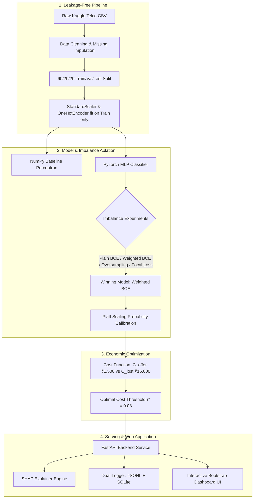
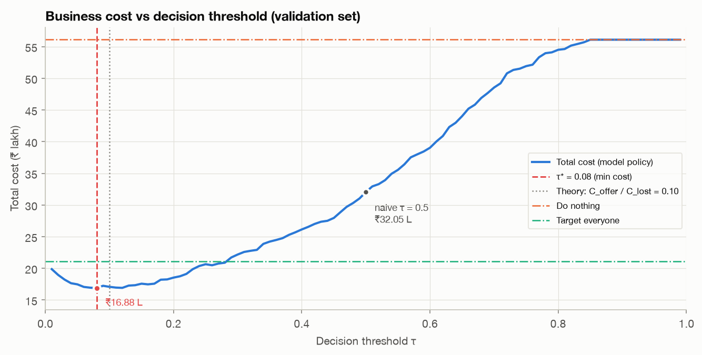

<p align="center">
  
</p>

<h1 align="center">Telecom Churn Early-Warning Dashboard</h1>

<p align="center">
  <strong>Cost-Optimal Deep Learning Early-Warning System with Explainable AI & Production FastAPI Service</strong>
</p>

<p align="center">
  <em>MDS471 Neural Networks & Deep Learning — Project P5</em>
</p>

<p align="center">
  <a href="https://nndl-gqaf.onrender.com"><strong>🚀 Click Here to Open Live Dashboard on Render</strong></a>
</p>

<p align="center">
  <a href="#quickstart">⚡ Quickstart</a> •
  <a href="#key-features">✨ Key Features</a> •
  <a href="#system-architecture">🏗️ Architecture</a> •
  <a href="#1-results-at-a-glance">📊 Results</a> •
  <a href="#3-team-roles">👥 Team</a> •
  <a href="#18-report-video-demo--viva">🎓 Viva Guide</a> •
  <a href="docs/README_DESIGN_PLAYBOOK.md">🎨 Design Playbook</a>
</p>

<p align="center">
  <a href="https://nndl-gqaf.onrender.com"></a>
  
  
  
  
  
  
</p>

<br />

<div align="center">
  <table>
    <tr>
      <td align="center" width="25%"><strong>Churners Caught</strong><br /><h2>96.5 %</h2><sub>361 of 374 churners</sub></td>
      <td align="center" width="25%"><strong>Cost Reduction</strong><br /><h2>70.6 %</h2><sub>vs inaction policy</sub></td>
      <td align="center" width="25%"><strong>Net Savings</strong><br /><h2>₹14.7 Lakhs</h2><sub>vs naive threshold</sub></td>
      <td align="center" width="25%"><strong>Peak F1 Score</strong><br /><h2>0.613</h2><sub>minority class</sub></td>
    </tr>
  </table>
</div>

<br />

---

## <a id="key-features"></a>✨ Key Features & Technical Highlights

<table width="100%">
  <tr>
    <td width="50%" valign="top">
      <h3>🧠 Deep Learning & From-Scratch Baselines</h3>
      <p>Custom PyTorch MLP with BatchNorm, Dropout, L2 decay and early stopping, alongside a pure NumPy single-layer perceptron with analytical backpropagation and gradient check.</p>
    </td>
    <td width="50%" valign="top">
      <h3>⚖️ Cost-Sensitive Decision Theory (10:1 Ratio)</h3>
      <p>Instead of arbitrary 0.5 cutoffs, policy optimizes the real business asymmetry: ₹1,500 retention offer vs ₹15,000 lost customer, driving total test-set cost down from ₹56.1L to ₹16.5L.</p>
    </td>
  </tr>
  <tr>
    <td width="50%" valign="top">
      <h3>🔍 Transparent Explainable AI (SHAP)</h3>
      <p>Local and global feature attribution reveals exact drivers behind individual churn scores (contract length, fiber optics, tenure) with talking points for retention agents.</p>
    </td>
    <td width="50%" valign="top">
      <h3>⚡ Production-Grade FastAPI & Interactive UI</h3>
      <p>Sub-second batch scoring for up to 50k customers with real-time SVG probability distributions, interactive cost slider, customer inspection drawer, and CSV target export.</p>
    </td>
  </tr>
  <tr>
    <td width="50%" valign="top">
      <h3>🛡️ Zero-Leakage Data Pipeline</h3>
      <p>Strict 60/20/20 train/val/test partitioning; all scalers, one-hot encoders, and Platt calibration parameters are fitted strictly on training data with frozen random seeds.</p>
    </td>
    <td width="50%" valign="top">
      <h3>📜 Dual-Sink Prediction Logging</h3>
      <p>Enterprise auditability with append-only JSON Lines and SQLite mirrors recording timestamps, customer IDs, scores, thresholds, and model signatures for drift monitoring.</p>
    </td>
  </tr>
</table>

---

## <a id="system-architecture"></a>🏗️ System Architecture & Workflow



<p align="center">
  
</p>

---

## <a id="quickstart"></a>⚡ Quickstart: Run in One Command

> [!TIP]
> Everything is pre-trained and verified! You do not need to re-run the notebooks to start the dashboard immediately.

```bash
# macOS / Linux
./run_app.sh

# Windows
run_app.bat
```
The script automatically configures `.venv/`, installs dependencies, validates trained model artifacts, and launches the dashboard at **`http://localhost:8000`**.

---

## Contents
1. [Results at a glance](#1-results-at-a-glance)
2. [Course requirements → where they are met](#2-course-requirements--where-they-are-met)
3. [Team roles](#3-team-roles)
4. [Project structure](#4-project-structure)
5. [Setup (Colab via VS Code, local, tooling)](#5-setup)
6. [Running the pipeline — notebook by notebook](#6-running-the-pipeline--notebook-by-notebook)
7. [Key findings](#7-key-findings)
8. [The web application](#8-the-web-application)
9. [API reference](#9-api-reference)
10. [Prediction logging](#10-prediction-logging)
11. [Source modules (`src/`)](#11-source-modules-src)
12. [Artefacts, plots and results files](#12-artefacts-plots-and-results-files)
13. [Configuration you can change](#13-configuration-you-change)
14. [Reproducibility & leakage controls](#14-reproducibility--leakage-controls)
15. [Tests](#15-tests)
16. [Deployment](#16-deployment)
17. [Git workflow (distinct commits for both members)](#17-git-workflow-distinct-commits-for-both-members)
18. [Report, video demo & viva](#18-report-video-demo--viva)
19. [Troubleshooting](#19-troubleshooting)
20. [Honest limitations](#20-honest-limitations)
21. [Dataset & references](#21-dataset--references)

---

## 1. Results at a glance

Held-out **test set, evaluated once** (1,409 customers, notebook 07):

| Model | Implementation | Precision | Recall | F1 (Churn) | PR-AUC | ROC-AUC |
|---|---|---|---|---|---|---|
| Logistic Regression (τ = 0.50) | scikit-learn | 0.649 | 0.554 | 0.597 | 0.634 | 0.843 |
| Single-Layer Perceptron (τ = 0.50) | Pure NumPy (from scratch) | 0.648 | 0.556 | 0.599 | 0.631 | 0.841 |
| MLP + weighted BCE (τ = 0.50) | PyTorch + Platt calibration | 0.651 | 0.524 | 0.581 | 0.632 | 0.842 |
| MLP + weighted BCE (τ_F1 = 0.33, chosen on validation) | PyTorch + Platt calibration | 0.535 | 0.719 | **0.613** | 0.632 | 0.842 |
| **MLP + weighted BCE (τ\* = 0.08, deployed)** | PyTorch + Platt calibration | 0.372 | **0.965** | 0.537 | 0.632 | 0.842 |

| Policy on the test set | Customers targeted | Churners caught | Total cost |
|---|---|---|---|
| Do nothing | 0 | 0 / 374 | ₹56,10,000 |
| Target everyone | 1,409 | 374 / 374 | ₹21,13,500 |
| MLP at naive τ = 0.50 | 301 | 196 / 374 | ₹31,21,500 |
| **MLP at cost-optimal τ\* = 0.08** | 971 | 361 / 374 | **₹16,51,500** |

**Success criteria** (computed automatically in notebook 07 → `results/success_criteria.md`):

| Criterion | Status | Evidence |
|---|---|---|
| MLP matches or beats Logistic Regression on PR-AUC | ⚠️ matches (tie) | 0.632 vs 0.634; paired-bootstrap 95 % CI of the difference **[−0.010, +0.005]** contains 0 → statistically indistinguishable, but not a win |
| Churn-class F1 ≥ 0.60 | ✅ | 0.613 at the validation-chosen F1 threshold; 0.537 at the cost-optimal τ\* (deliberately recall-heavy because a missed churner costs 10× an offer) |
| Written threshold recommendation with cost figures | ✅ | `results/threshold_recommendation.md`, §7.4 below |
| Cost-based threshold beats the naive 0.5 threshold | ✅ | ₹16.5 L vs ₹31.2 L on test (saves ₹14.7 L; 70.6 % cheaper than doing nothing) |

---

## 2. Course requirements → where they are met

| Requirement (project brief / course rules) | Where |
|---|---|
| Cleaning (blank `TotalCharges`), encoding, scaling | `src/data_preprocessing.py`, notebook 02 |
| Logistic-regression baseline | notebook 03, `models/baselines/logreg.pkl` |
| Single-layer perceptron baseline — **mandatory from-scratch component** | `src/numpy_perceptron.py` (pure NumPy, hand-derived gradients + gradient check), notebook 03 |
| MLP with batch norm, dropout, L2 weight decay, early stopping — **framework component** | `src/model.py`, `src/training.py`, notebook 04 |
| Imbalance: plain vs class weights vs oversampling vs focal loss | `src/training.py`, `src/focal_loss.py` (from scratch), notebook 05 |
| Cost-based threshold minimising total cost | `src/cost_optimizer.py`, notebook 06 |
| Precision, recall, F1 (churn), PR-AUC, ROC-AUC, learning curves | `src/metrics.py`, notebooks 03–07, `plots/learning_curves.png` |
| Web app: CSV upload → ranked risk table; click → score + top drivers; cost slider → customers to target + savings | `app/`, [§8](#8-the-web-application) |
| Model served behind **our own API endpoint** | `app/main.py` (FastAPI) |
| Prediction logging | `app/logger.py` → `logs/predictions.jsonl` + SQLite |
| Fixed seeds, never-mixed train/val/test split, **test metrics reported once** | `src/config.py`, `load_splits(include_test=...)`, notebook 07 |
| Git repo with README, requirements.txt, commits from both members | this file, `requirements.txt`, [§17](#17-git-workflow-distinct-commits-for-both-members) |
| Public deployment **or** local demo with recorded video | Live on Render ([https://nndl-gqaf.onrender.com](https://nndl-gqaf.onrender.com)) · [docs/DEPLOY_RENDER.md](docs/DEPLOY_RENDER.md) |
| Optimiser comparison (SGD vs RMSprop vs Adam) and activation choice (Unit 1 & 2) | notebook 04, `plots/optimizer_comparison.png`, `plots/activation_derivatives.png` |
| SHAP explainability + `get_customer_top_drivers` | `src/explainability.py`, notebook 07 |

---

## 3. Team roles & Contributors

<table align="center" width="100%">
  <tr>
    <td align="center" width="50%" valign="top">
      <a href="https://github.com/fridayslifes">
        <br /><br />
        <strong>Praveen</strong>
      </a><br />
      <em>Application Lead</em><br /><br />
      <sub>FastAPI Backend · Dashboard UI · Prediction Logging · Cloud Deployment (Render) · API Tests</sub>
    </td>
    <td align="center" width="50%" valign="top">
      <a href="https://github.com/riya0jani">
        <br /><br />
        <strong>Riya</strong>
      </a><br />
      <em>Model Lead</em><br /><br />
      <sub>Data Pipeline · Leakage Controls · NumPy Perceptron · PyTorch MLP · Imbalance Ablation · Platt Calibration</sub>
    </td>
  </tr>
</table>

| Member | Role | GitHub | Owns |
|---|---|---|---|
| **Praveen** | Application Lead | [@fridayslifes](https://github.com/fridayslifes) | Inference API, dashboard UI, prediction logging, deployment, API tests (`app/`, `src/inference.py`, `Dockerfile`, `tests/test_api.py`) |
| **Riya** | Model Lead | [@riya0jani](https://github.com/riya0jani) | Data pipeline, preprocessing, baselines, MLP, imbalance ablation, calibration & cost threshold (notebooks 01–06, `src/` except `inference.py`) |
| Both | Joint Deliverables | — | Final evaluation & SHAP (notebook 07), report, README, viva — **each member can explain every line of the training and application code** |

---

## 4. Project structure

```
telco-churn-dashboard/
├── data/
│   ├── Telco-Customer-Churn.csv        # raw dataset (IBM / Kaggle), 7,043 rows × 21 columns
│   ├── sample_demo.csv                 # 50 unlabelled raw TEST customers for the UI demo (no Churn column)
│   └── processed/
│       ├── splits.npz                  # encoded X/y/IDs for train, val, test (+ feature names)
│       └── {train,val,test}_clean.csv  # cleaned, human-readable splits
├── notebooks/
│   ├── 01_eda.ipynb                    # Riya — distributions, churn rates, correlations, key observations
│   ├── 02_preprocessing.ipynb          # Riya — cleaning, stratified 60/20/20 split, fit-on-train encoding, sample_demo.csv
│   ├── 03_baselines.ipynb              # Riya — logistic regression + from-scratch NumPy perceptron
│   ├── 04_mlp_training.ipynb           # Riya — PyTorch MLP, early stopping, optimiser comparison, activations
│   ├── 05_imbalance_experiments.ipynb  # Riya — plain BCE / weighted BCE / oversampling / focal loss (+5-seed check)
│   ├── 06_cost_threshold.ipynb         # Riya & Praveen — Platt calibration, cost sweep, τ*, sensitivity
│   └── 07_final_evaluation.ipynb       # Riya & Praveen — single test-set run, bootstrap CI, SHAP
├── src/                                # reusable modules imported by the notebooks AND the API
│   ├── config.py                       # paths, seeds, hyper-parameters, business costs, risk tiers
│   ├── data_preprocessing.py           # load/validate, clean, split, fit-on-train-only encoding, persistence
│   ├── numpy_perceptron.py             # FROM-SCRATCH single-layer perceptron (pure NumPy)
│   ├── model.py                        # ChurnMLP + CalibratedChurnModel (PyTorch)
│   ├── focal_loss.py                   # FROM-SCRATCH focal loss (PyTorch)
│   ├── training.py                     # training loop, EarlyStopping, imbalance strategies
│   ├── metrics.py                      # churn-class metrics, F1-optimal threshold, bootstrap CI
│   ├── calibration.py                  # Platt scaling, reliability-diagram data, Brier score
│   ├── cost_optimizer.py               # cost model, threshold sweep, savings, recommendation text
│   ├── explainability.py               # SHAP DeepExplainer wrapper, get_customer_top_drivers
│   ├── inference.py                    # ChurnPredictor — the single object the API talks to
│   └── plotting.py                     # colour-blind-safe matplotlib style + all standard figures
├── app/
│   ├── main.py                         # FastAPI backend (10 endpoints)
│   ├── logger.py                       # PredictionLogger (JSONL + SQLite mirror)
│   ├── templates/index.html            # dashboard page (Bootstrap 5 + custom SVG icon sprite)
│   └── static/
│       ├── css/styles.css              # design tokens, light/dark themes, components
│       ├── js/app.js                   # upload, cost engine, charts, table, drawer, logs, export
│       └── img/                        # logo: favicon.svg, favicon.ico, apple-touch-icon.png, logo-512.png
├── models/
│   ├── scaler.pkl · encoder.pkl · feature_columns.pkl   # fitted on TRAIN only (notebook 02)
│   ├── best_model.pth                  # deployed MLP weights (weighted BCE, seed 42)
│   ├── model_config.json               # architecture, strategy, calibration, τ*, costs, test metrics
│   ├── shap_background.npy             # 200 training rows for SHAP
│   ├── mlp_plain_bce.pth               # notebook 04 model
│   ├── baselines/{logreg.pkl, perceptron.npz}
│   └── ablation/{plain_bce, weighted_bce, oversampling, focal_loss}.pth
├── logs/                               # predictions.jsonl, predictions_log.db
├── plots/                              # 20 figures used in the report (list in §12)
├── results/                            # metric tables (CSV/JSON) + generated text (list in §12)
├── report/
│   ├── report.md                       # co-written report draft (export to PDF)
│   └── viva_guide.md                   # ~40 viva questions with answers
├── docs/
│   ├── GITHUB_COLLABORATION_GUIDE.md   # step-by-step GitHub collaboration for both members
│   ├── DEPLOY_RENDER.md                # free cloud deployment guide for Render
│   ├── README_DESIGN_PLAYBOOK.md       # universal design playbook & component kit
│   └── assignment_brief.docx           # course project assignment brief & rubric
├── tests/                              # 49 pytest tests
├── render.yaml                         # Render infrastructure-as-code deployment config
├── START_HERE.md                       # 1-minute quick start
├── run_app.sh · run_app.bat            # one-click launchers (create .venv, install, start the app)
├── Dockerfile                          # container for Docker / Render deployments
├── requirements.txt
└── README.md
```

---

## 5. Setup

### 5.1 Google Colab via VS Code (the course setup)

1. Copy the whole `telco-churn-dashboard/` folder to **`MyDrive/telco-churn-dashboard`** on Google Drive (or `git clone` your repository there from a Colab cell).
2. In VS Code open a notebook, click **Select Kernel → Colab** and connect to a runtime (a GPU is optional — everything runs on CPU in seconds).
3. Every notebook starts with the same two cells:
   * **Setup cell** — mounts Drive (`drive.mount('/content/drive')`), sets `PROJECT_ROOT = '/content/drive/MyDrive/telco-churn-dashboard'`, `chdir`s there and adds it to `sys.path` so `import src...` works. Run locally, it detects the project root automatically instead.
   * **Install cell** — on Colab only: `%pip install -q imbalanced-learn shap fastapi uvicorn jinja2 python-multipart joblib` (torch, numpy, pandas, scikit-learn and matplotlib are pre-installed).
4. Run notebooks **01 → 07 in order**. Notebook 01 downloads the dataset if it is missing.

> The repository already contains every trained artefact, so the web app works immediately after cloning — re-running the notebooks is only needed to reproduce results.

### 5.2 Locally (macOS / Linux / Windows)

**Fastest way:** run `./run_app.sh` (macOS/Linux) or double-click `run_app.bat` (Windows). It creates `.venv/`, installs `requirements.txt` on the first run, starts the dashboard and opens http://localhost:8000 — see `START_HERE.md`. Manual steps:

```bash
python -m venv .venv && source .venv/bin/activate
```
```bash
pip install -r requirements.txt
```
Re-run the whole pipeline headlessly (≈2 minutes on a laptop CPU):
```bash
jupyter nbconvert --to notebook --execute --inplace notebooks/0[1-7]_*.ipynb
```
Tested with Python 3.12, torch 2.14, numpy 2.5, pandas 3.0, scikit-learn 1.9, shap 0.52, FastAPI 0.142 (minimum versions in `requirements.txt` also work on Colab).

### 5.3 Recommended developer tooling

**VS Code extensions**

| Extension | Why |
|---|---|
| `google.colab` | Run notebooks on a Colab kernel from VS Code |
| `ms-toolsai.jupyter` | Interactive notebook execution |
| `ms-python.python`, `ms-python.vscode-pylance` | Python language support, type hints, go-to-definition |
| `rangav.vscode-thunder-client` | Test the FastAPI endpoints (also try the Swagger UI at `/docs`) |
| `mechatroner.rainbow-csv` | Readable CSV inspection |
| `eamodio.gitlens` | Show who wrote which line — useful to demonstrate distinct contributions |

**Claude MCP connectors (optional)** — add to `claude_desktop_config.json` so an assistant can read project files, inspect the SQLite prediction log and manage GitHub:

```json
{
  "mcpServers": {
    "filesystem": { "command": "npx", "args": ["-y", "@modelcontextprotocol/server-filesystem", "/content/drive/MyDrive/telco-churn-dashboard"] },
    "github": { "command": "npx", "args": ["-y", "@modelcontextprotocol/server-github"], "env": { "GITHUB_PERSONAL_ACCESS_TOKEN": "<YOUR_TOKEN>" } },
    "sqlite": { "command": "uvx", "args": ["mcp-server-sqlite", "--db-path", "logs/predictions_log.db"] }
  }
}
```
Never commit a real token — keep `<YOUR_TOKEN>` out of the repository.

---

## 6. Running the pipeline — notebook by notebook

| # | Notebook | What it does | Saves |
|---|---|---|---|
| 01 | `01_eda.ipynb` | Downloads the data, finds the `TotalCharges` blanks, plots churn distribution, numeric features by class, churn rate per category, correlations; writes 5 key observations | `plots/churn_distribution.png`, `feature_distributions_by_churn.png`, `categorical_churn_rates.png`, `correlation_heatmap.png`, `churn_correlation_ranking.png` |
| 02 | `02_preprocessing.ipynb` | Cleans, stratified 60/20/20 split, disjoint-split assertion, fits scaler + one-hot **on train only**, proves no leakage, builds the demo CSV | `models/scaler.pkl`, `encoder.pkl`, `feature_columns.pkl`, `data/processed/*`, `data/sample_demo.csv` |
| 03 | `03_baselines.ipynb` | Logistic regression; NumPy perceptron with gradient check and learning-rate sweep; weight comparison | `models/baselines/*`, `results/baselines_val.csv`, `plots/perceptron_learning_rate.png` |
| 04 | `04_mlp_training.ipynb` | Builds the MLP (4,929 parameters), trains with Adam + L2 + early stopping, SGD vs RMSprop vs Adam, ReLU vs sigmoid gradients | `models/mlp_plain_bce.pth`, `plots/learning_curves.png`, `optimizer_comparison.png`, `activation_derivatives.png`, `results/optimizer_comparison.csv` |
| 05 | `05_imbalance_experiments.ipynb` | Focal-loss sanity checks; 4 strategies at seed 42; 5-seed robustness; picks the winner | `models/ablation/*`, `models/best_model.pth`, `results/ablation_*.csv`, `plots/ablation_*.png`, `focal_loss_curves.png` |
| 06 | `06_cost_threshold.ipynb` | Platt calibration, threshold sweep 0.01–0.99, τ\*, written recommendation, projection check, cost sensitivity | `results/cost_sweep_val.csv`, `threshold_recommendation.md`, `threshold_sensitivity.csv`, `plots/cost_vs_threshold.png`, `calibration_reliability.png`, `threshold_sensitivity.png` |
| 07 | `07_final_evaluation.ipynb` | **Only place the test split is loaded.** All models on test once, bootstrap CI, confusion matrix, ROC/PR, cost on test, success criteria, SHAP | `results/final_test_metrics.csv`, `test_metrics.json`, `success_criteria.md`, `plots/confusion_matrix.png`, `roc_pr_curves.png`, `shap_*.png`, `models/shap_background.npy` |

`models/model_config.json` is built up progressively: 04 writes `architecture` + `training`, 05 `imbalance_strategy`, 06 `calibration` + `threshold` + `costs` + `risk_tiers`, 07 `test_metrics`. The web app reads it at start-up.

---

## 7. Key findings

### 7.1 Exploratory data analysis (notebook 01)
1. **Imbalance:** 1,869 of 7,043 customers churned (**26.5 %**, 2.77 : 1). A "nobody churns" model is 73.5 % accurate and useless — so we use churn-class F1 and PR-AUC.
2. **Contract** is the strongest driver: month-to-month **42.7 %** churn vs one-year 11.3 % vs two-year 2.8 %.
3. **Tenure:** churners' median tenure is 10 months vs 38; first-year customers churn at 47.4 % vs 9.5 % after four years.
4. **Product & price:** fibre optic 41.9 % (DSL 19.0 %); fibre + month-to-month (2,128 customers) churns at **54.6 %**.
5. **Payment & support:** electronic cheque 45.3 % (others 15–19 %); no TechSupport / OnlineSecurity ≈ 42 % vs ≈ 15 % with them.
6. **Data quality:** 11 blank `TotalCharges` — all with `tenure = 0` (never billed) → filled with 0.0.

### 7.2 Baselines (validation, τ = 0.5 — notebook 03)

| Model | Implementation | Precision | Recall | F1 | PR-AUC | ROC-AUC |
|---|---|---|---|---|---|---|
| Logistic Regression | scikit-learn | 0.657 | 0.532 | 0.588 | 0.642 | 0.836 |
| Single-Layer Perceptron | Pure NumPy | 0.667 | 0.535 | 0.594 | 0.640 | 0.835 |

Gradient check: analytic vs finite-difference relative error **2.4 × 10⁻¹⁰**. Learning rate chosen on validation from {0.5, 0.1, 0.05, 0.01} → **0.01** (η = 0.5 oscillates).

### 7.3 MLP, optimisers and imbalance (notebooks 04–05)

**Optimiser comparison** (identical init and batch order, 30 epochs):

| Optimiser | Train loss @1 | @5 | @30 | Val PR-AUC @30 |
|---|---|---|---|---|
| SGD + momentum (η 0.01, β 0.9) | 0.515 | 0.429 | 0.398 | 0.625 |
| RMSprop (η 0.001) | 0.494 | 0.425 | 0.394 | 0.627 |
| Adam (η 0.001) | 0.604 | 0.428 | **0.391** | **0.629** |

Adam starts slowest but reaches the lowest loss and best PR-AUC; the speed advantage over well-tuned SGD-momentum is small on this well-conditioned problem.

**Imbalance ablation** (validation, τ = 0.5, seed 42; last column = 5 seeds):

| Strategy | Precision | Recall | F1 | PR-AUC | ROC-AUC | PR-AUC, seeds 42–46 |
|---|---|---|---|---|---|---|
| 1. Plain BCE | 0.641 | 0.559 | 0.597 | 0.631 | 0.832 | 0.6351 ± 0.0039 |
| 2. **Weighted BCE** (pos_weight 2.77) | 0.498 | 0.791 | 0.611 | **0.635** | **0.834** | **0.6381 ± 0.0025** |
| 3. Random oversampling | 0.526 | 0.751 | 0.619 | 0.626 | 0.831 | 0.6309 ± 0.0063 |
| 4. Focal loss, from scratch (γ 2, α 0.75) | 0.481 | 0.826 | 0.608 | 0.632 | 0.833 | 0.6358 ± 0.0034 |

**Winner: weighted BCE** — highest mean validation PR-AUC over five seeds (rule fixed in advance), lowest variance.

### 7.4 Calibration and threshold (notebook 06)
* **Platt scaling** p = σ(1.012·z − 1.088): mean predicted probability 0.432 → **0.265** (= observed rate), Brier 0.175 → 0.139, ranking unchanged.
* **τ\* = 0.08** (theory: C_offer / C_lost = 0.10).
* **Recommendation (validation, 1,409 customers):** offer everyone with calibrated churn probability ≥ 8 % → 975 customers (69.2 %), catching 359 of 374 churners, total cost **₹16,87,500** vs ₹56,10,000 for doing nothing (saves ₹39,22,500 = 69.9 %) and ₹21,13,500 for targeting everyone (saves ₹4,26,000 = 20.2 %). The naive 0.5 threshold would cost ₹32,05,500.
* **Sensitivity:** raising C_offer to ₹6,000 moves τ\* to 0.44 and shrinks the campaign to 354 customers — τ\* follows C_offer / C_lost.

### 7.5 Explainability (notebook 07)
Global drivers (mean |SHAP|, percentage points of churn probability): **Contract 7.1**, **tenure 5.7**, **InternetService 4.7**, MonthlyCharges 3.2, PaymentMethod 2.9, TotalCharges 2.7, OnlineSecurity 2.6, TechSupport 2.2. SHAP values add up to each prediction within ≈10⁻⁷.

---

## 8. The web application

Start it from the project root:
```bash
uvicorn app.main:app --host 0.0.0.0 --port 8000 --reload
```
Open http://localhost:8000 · Swagger API docs at http://localhost:8000/docs.

| Feature | How to use it |
|---|---|
| **Upload** | Drag a CSV anywhere onto the page, click the drop zone, or press **Try it with 50 sample customers**. `customerID` is optional; a `Churn` column is ignored. |
| **Tier mix bar** | High (> 70 %) ▲ · Medium (40–70 %) ◆ · Low (< 40 %) ✓ — shape + colour + label. |
| **Campaign planner** | Slider for τ with markers and presets: **Recommended** (τ\* from validation), **Break-even** (C_offer / C_lost), **Cheapest here** (cheapest τ for the uploaded batch). Editable offer and lost-revenue costs. |
| **KPI tiles** | Projected net savings vs doing nothing, customers targeted, campaign cost, expected loss from missed churners, expected total cost — all update live. |
| **Charts** | Histogram of churn probability (targeted vs not) and expected-cost curve; hover for details, **click the cost curve to set τ**. |
| **Ranked table** | Sort by risk / tenure / monthly charges, filter by tier, search by ID, "Targeted only" toggle; each risk bar shows where τ sits. |
| **Customer panel** | Click a row: risk gauge, offer decision and its expected value (p × C_lost − C_offer), top-5 SHAP drivers, suggested talking points, full profile; ↑/↓ moves between customers. |
| **Export targets** | Downloads `retention_targets_tau_<τ>.csv` for the retention team (formula-injection safe). |
| **Prediction log** | Totals, high-risk share, latest activity, filterable table of logged predictions, and a **Clear log** button (asks for confirmation; empties both the JSONL file and the SQLite table). |
| **Model card** | Test metrics, scoring pipeline, deployed configuration and the campaign formulas. |
| **Theme** | Automatic / light / dark (header button, remembered per browser). |

**How the campaign numbers are computed** (identical in `src/cost_optimizer.expected_cost_unlabeled` and `app/static/js/app.js`):

* campaign cost = (customers with p ≥ τ) × C_offer
* expected missed loss = Σ_{p<τ} p × C_lost
* do nothing = Σ p × C_lost
* net savings = do nothing − (campaign cost + expected missed loss)

These are expected values, which is valid because the probabilities are calibrated.

**Design notes:** custom 24 px line-icon set (inline SVG sprite in `index.html`) and radar logo (`app/static/img/`); colour roles are CSS tokens with a dark theme; charts are SVG with tooltips and ARIA text; the slider's economics use sorted probabilities + prefix sums (one binary search per τ) so they stay instant for 50,000 customers; all uploaded values are HTML-escaped.

---

## 9. API reference

| Method | Path | Purpose |
|---|---|---|
| GET | `/` | Dashboard page |
| GET | `/api/health` | Liveness; `model_loaded`, `model_version`, active log backends |
| GET | `/api/config` | τ\*, costs, risk tiers, strategy, calibration, required columns, test metrics |
| POST | `/api/predict` | Multipart CSV (`file`) + optional form field `threshold` → customers ranked by probability — **logged** |
| POST | `/api/predict/single` | One customer as JSON (validated schema) → probability, tier, decision, top-5 drivers — **logged** |
| POST | `/api/explain` | `{"record": {...}, "top_k": 5}` → SHAP drivers + base value (re-explains an already-logged prediction) |
| GET | `/api/logs?limit=100` | Latest log records (newest first) + totals |
| DELETE | `/api/logs` | Clear the prediction log (the **Clear log** button); 403 when `CHURN_ALLOW_LOG_CLEAR=0` |
| GET | `/api/sample-csv` | Download `data/sample_demo.csv` |
| GET | `/favicon.ico` | App icon |

Examples:
```bash
curl -F "file=@data/sample_demo.csv" -F "threshold=0.08" http://localhost:8000/api/predict
```
```bash
curl -X POST http://localhost:8000/api/predict/single -H "Content-Type: application/json" -d '{"customerID":"DEMO-0001","gender":"Female","SeniorCitizen":0,"Partner":"No","Dependents":"No","tenure":2,"PhoneService":"Yes","MultipleLines":"No","InternetService":"Fiber optic","OnlineSecurity":"No","OnlineBackup":"No","DeviceProtection":"No","TechSupport":"No","StreamingTV":"Yes","StreamingMovies":"No","Contract":"Month-to-month","PaperlessBilling":"Yes","PaymentMethod":"Electronic check","MonthlyCharges":89.1,"TotalCharges":178.2}'
```

**Required CSV columns (19):** gender, SeniorCitizen, Partner, Dependents, tenure, PhoneService, MultipleLines, InternetService, OnlineSecurity, OnlineBackup, DeviceProtection, TechSupport, StreamingTV, StreamingMovies, Contract, PaperlessBilling, PaymentMethod, MonthlyCharges, TotalCharges.

**Input handling:** blank `TotalCharges` with tenure 0 → 0.0 (tenure > 0 → tenure × MonthlyCharges, with a warning); rows with missing/negative tenure or charges are skipped and listed; unseen categories are encoded as zeros and reported; missing `customerID` → `ROW-0001`-style IDs.

**Errors:** 400 not a CSV / empty / unparseable · 413 > 10 MB or > 50,000 rows · 422 missing columns (listed in the response), invalid JSON fields or τ outside [0, 1] · 503 model artefacts missing (the server still starts and explains why).

---

## 10. Prediction logging

Every scored customer appends one line to **`logs/predictions.jsonl`** (append-only JSON Lines) and to the SQLite table `predictions` in **`logs/predictions_log.db`**:

```json
{"timestamp": "2026-09-30T13:34:19.512+00:00", "customer_id": "9611-CTWIH", "churn_probability": 0.779877,
 "risk_tier": "High", "threshold_used": 0.08, "flagged_for_offer": true, "batch_id": "4f5a79ce…",
 "source": "csv_upload", "model_version": "weighted_bce-6b911fc9"}
```

* `model_version` = winning strategy + first 8 hex characters of the SHA-256 of `best_model.pth` → every decision is traceable to exact weights.
* `threshold_used` is the τ on the slider at upload time.
* Choose backends with `CHURN_LOG_BACKEND=jsonl|sqlite|both` (default `both`); if SQLite fails (e.g. file locking on Google Drive) it is disabled with a warning and JSONL continues.
* **Clear the log** from the dashboard (*Prediction log → Clear log*) or with `curl -X DELETE http://localhost:8000/api/logs`. On a public deployment set `CHURN_ALLOW_LOG_CLEAR=0` to hide the button and block the endpoint — logs are an audit trail.
* Inspect the log: `tail -n 5 logs/predictions.jsonl`, `pd.read_json("logs/predictions.jsonl", lines=True)`, the **Prediction log** tab, or `GET /api/logs`.
* **Why it matters:** drift monitoring, auditing retention decisions, and measuring real campaign impact once outcomes are joined back.

---

## 11. Source modules (`src/`)

| Module | Key functions / classes |
|---|---|
| `config.py` | `set_seed`, `get_device`, `ensure_dirs`, `load_model_config`, `update_model_config`, all paths and constants |
| `data_preprocessing.py` | `load_raw_data`, `clean_dataframe` (+ `CleaningReport`), `split_data`, `assert_disjoint_splits`, `fit_preprocessors`, `transform_features`, `get_feature_names`, `get_feature_origins`, `prepare_inference_features`, `save/load_preprocessors`, `save/load_splits(include_test=False)` |
| `numpy_perceptron.py` | `NumpyPerceptron` — `sigmoid`, `bce_loss`, `forward`, `compute_gradients`, `fit`, `predict_proba`, `gradient_check`, `save`, `load` |
| `model.py` | `ChurnMLP` (`logits`, `forward`), `CalibratedChurnModel`, `build_model`, `load_model`, `predict_logits`, `predict_proba`, `count_parameters` |
| `focal_loss.py` | `FocalLoss(alpha=0.75, gamma=2.0)` from logits with `logsigmoid` |
| `training.py` | `train_mlp`, `EarlyStopping`, `make_loader` (`drop_last=True`), `prepare_imbalance_strategy`, `IMBALANCE_STRATEGIES` |
| `metrics.py` | `classification_metrics`, `find_f1_optimal_threshold`, `bootstrap_pr_auc_difference`, `metrics_table`, `to_markdown_table` |
| `calibration.py` | `PlattCalibrator` (`fit`, `transform`), `reliability_summary` |
| `cost_optimizer.py` | `CostParams` (`breakeven_probability`), `sweep_thresholds`, `find_optimal_threshold`, `savings_summary`, `expected_cost_unlabeled`, `write_recommendation`, `format_currency` |
| `explainability.py` | `ChurnExplainer` (`shap_values`, `aggregate`, `global_importance`), `get_customer_top_drivers`, `select_background` |
| `inference.py` | `ChurnPredictor` (`predict_dataframe`, `explain_record`, `metadata`), `risk_tier`, `summarize_services` |
| `plotting.py` | `apply_style` and every report figure (learning curves, optimiser comparison, confusion matrix, ROC/PR, cost curve, reliability, SHAP bars) |

Every function has a docstring explaining the maths so it can be defended in the viva.

---

## 12. Artefacts, plots and results files

**Plots (`plots/`):** `churn_distribution`, `feature_distributions_by_churn`, `categorical_churn_rates`, `correlation_heatmap`, `churn_correlation_ranking`, `perceptron_learning_rate`, `learning_curves`, `optimizer_comparison`, `activation_derivatives`, `focal_loss_curves`, `ablation_learning_curves`, `ablation_metrics`, `calibration_reliability`, `cost_vs_threshold`, `threshold_sensitivity`, `confusion_matrix`, `roc_pr_curves`, `shap_summary`, `shap_global_importance`, `shap_customer_example` (all `.png`, 150 dpi).

**Results (`results/`):** `baselines_val.csv`, `optimizer_comparison.csv`, `mlp_plain_bce_history.json`, `ablation_val.csv`, `ablation_val_extra.csv`, `ablation_seeds.csv`, `cost_sweep_val.csv`, `cost_summary_val.json`, `threshold_recommendation.md`, `threshold_sensitivity.csv`, `final_test_metrics.csv`, `cost_summary_test.json`, `test_metrics.json`, `success_criteria.md`.

**`models/model_config.json` sections:** `architecture`, `training`, `imbalance_strategy`, `calibration`, `threshold` (`optimal`, `naive`, `theoretical`, `f1_optimal_val`), `costs`, `risk_tiers`, `test_metrics`.

---

## 13. Configuration you can change

All in `src/config.py` (re-run notebooks 04–07 after changing model or cost settings):

| Setting | Default | Effect |
|---|---|---|
| `SEED` | 42 | All randomness |
| `TRAIN/VAL/TEST_SIZE` | 0.6 / 0.2 / 0.2 | Split proportions |
| `HIDDEN_DIMS`, `DROPOUT` | (64, 32), 0.3 | MLP architecture |
| `LEARNING_RATE`, `WEIGHT_DECAY` | 1e-3, 1e-4 | Adam + L2 |
| `BATCH_SIZE`, `MAX_EPOCHS`, `PATIENCE` | 64, 150, 10 | Training / early stopping |
| `FOCAL_ALPHA`, `FOCAL_GAMMA` | 0.75, 2.0 | Focal loss |
| `C_OFFER`, `C_LOST` | ₹1,500, ₹15,000 | Business costs → τ\* |
| `HIGH_RISK_MIN`, `MEDIUM_RISK_MIN` | 0.70, 0.40 | Dashboard tiers |

Environment variables: `CHURN_PROJECT_ROOT` (override project root), `CHURN_LOG_DIR` (log folder), `CHURN_LOG_BACKEND` (`jsonl` / `sqlite` / `both`), `CHURN_ALLOW_LOG_CLEAR` (`1` default / `0` to forbid clearing the log), `PORT` (Docker).
The costs can also be changed live in the dashboard without retraining.

---

## 14. Reproducibility & leakage controls

* `set_seed(42)` seeds Python, NumPy and PyTorch (CPU + CUDA) and makes cuDNN deterministic; called before building every model. The DataLoader uses a seeded generator. Re-running reproduces byte-identical weights (hash `6b911fc9`).
* Stratified 60/20/20 split (4,225 / 1,409 / 1,409; 26.5 % churn in each); `assert_disjoint_splits` checks no customer is in two splits.
* Scaler and encoder are fitted on **train only**; validation/test/uploads are only transformed (notebook 02 shows train mean 0 / std 1 but not val/test).
* Oversampling is applied to the training split only.
* Learning rate, imbalance strategy, calibration and τ\* are all chosen on **validation**.
* `load_splits()` hides the test split unless `include_test=True`, used only in notebook 07 — **test metrics are reported once**.
* The web app runs the same `src/` code as training (no training/serving skew).

---

## 15. Tests

```bash
python -m pytest -q
```
**49 tests:** perceptron gradients and stability, focal-loss identities (γ = 0, α = 0.5 ⇒ ½·BCE), cost formulas and edge cases, cleaning/splitting/leakage guards, MLP architecture (4,929 parameters), early stopping, reproducibility, calibration wrapper, and end-to-end API tests (upload, ranking, logging, errors, explain, single prediction, icons/static assets, clearing the log). API tests are skipped if artefacts are missing and write logs to a temporary folder, never to `logs/`.

---

## 16. Deployment

**Option A — run locally (simplest for the recorded demo):** `uvicorn app.main:app --host 0.0.0.0 --port 8000` and open http://localhost:8000.

**Option B — Live Cloud Deployment on Render (Active):**  
The application is deployed live at: **[https://nndl-gqaf.onrender.com](https://nndl-gqaf.onrender.com)**  
Full setup and configuration guide: [docs/DEPLOY_RENDER.md](docs/DEPLOY_RENDER.md).

**Option C — Docker (Local & Containers):**
```bash
docker build -t churn-dashboard .
docker run -p 7860:7860 churn-dashboard
```
The image uses CPU-only PyTorch and contains `src/`, `app/`, `models/` and the demo CSV; it listens on `$PORT` (default 7860).

---

## 17. Git workflow (distinct commits for both members)

The course requires commit history from **both** members in their lead roles, so **each person commits their own work from their own GitHub account** (do not share tokens or commit on someone else's behalf).

1. Praveen created the GitHub repository ([`fridayslifes/NNDL`](https://github.com/fridayslifes/NNDL)) and added Riya as a collaborator.
2. Praveen (Application Lead) committed the application architecture, FastAPI backend, dashboard UI, and deployment configs.
3. Riya (Model Lead) committed the data pipeline, baselines, PyTorch MLP, imbalance ablation, calibration, and trained weights.
4. Shared deliverables: notebook 07, `src/explainability.py`, `report/`, `README.md`.
5. `models/*.pth` and `models/*.pkl` are committed so a fresh clone runs the web app immediately.

A complete walkthrough for **GitHub** is in [docs/GITHUB_COLLABORATION_GUIDE.md](docs/GITHUB_COLLABORATION_GUIDE.md). It covers credentials, step-by-step commit commands per person, contributor verification, and checklists.

**Before recording the demo, clear test predictions** with the dashboard's **Clear log** button (*Prediction log* tab).

---

## 18. Report, video demo & viva

**Report (6–10 pages):** draft in `report/report.md` following the required outline — (1) executive summary & CO1 mapping, (2) EDA, (3) data pipeline & leakage controls, (4) baselines & back-propagation derivation, (5) MLP architecture & optimisation, (6) imbalance ablation, (7) cost-based threshold, (8) test evaluation, (9) explainability, (10) application architecture & logging, (11) conclusion & viva summary. Rewrite it in your own words, then export:
```bash
pandoc report/report.md -o report/report.pdf --resource-path=report --pdf-engine=xelatex -V mainfont="DejaVu Serif" -V geometry:margin=2.2cm
```
(On Colab: `!apt-get -q install pandoc texlive-xetex fonts-dejavu` first; or use the VS Code *Markdown PDF* extension.)

**Video demo checklist (3–5 min):**
1. `uvicorn app.main:app` → open the dashboard (header chip shows the model version).
2. Drag `sample_demo.csv` onto the page or click **Try it with 50 sample customers** → toast confirms the logged batch.
3. Tier mix bar and ranked table; sort by tenure, filter to High.
4. Move the τ slider → targeted customers, campaign cost and savings update live; use the **Recommended / Break-even / Cheapest here** presets; hover and click the cost curve; raise the offer cost and watch τ rise.
5. Click the top customer → gauge, offer decision + expected value, top-5 SHAP drivers, talking points; ↓ to the next customer.
6. **Export targets** CSV.
7. **Prediction log** tab and `tail logs/predictions.jsonl` in a terminal; **Model card** tab.
8. 30-second tour of `src/`, `app/` and `models/`.

**Viva:** `report/viva_guide.md` has ~40 questions with answers grounded in these results, including the seven from the brief (with corrections where our data disagree — e.g. Adam was *not* dramatically faster than SGD-momentum here).

---

## 19. Troubleshooting

| Problem | Fix |
|---|---|
| `FileNotFoundError: Dataset not found` | Run notebook 01 (downloads it) or the `wget` command shown in the error |
| Dashboard banner "Model not ready" / API returns 503 | Artefacts missing — run notebooks 02–07 (or restore `models/`) and restart uvicorn |
| `Port 8000 is in use` | Another server is running — stop it, or start on another port: `uvicorn app.main:app --port 8001` |
| Upload returns 422 "missing column(s)" | The CSV needs the 19 columns listed in §9 (names are case-sensitive) |
| `Expected more than 1 value per channel` | BatchNorm got a batch of 1 — keep `drop_last=True` in `make_loader` |
| SQLite "database is locked" on Google Drive | Set `CHURN_LOG_BACKEND=jsonl` (JSONL keeps working automatically) |
| Slightly different numbers on Colab GPU | Expected small floating-point differences; notebook text is generated from the computed values |
| Changes to `app/main.py` not visible | Restart uvicorn (or run it with `--reload`) |

---

## 20. Honest limitations

1. The MLP **ties** logistic regression on PR-AUC — the dominant signals (contract, tenure, internet type) act almost additively, so a linear model already captures most of the structure.
2. The cost model assumes an offer always retains a churner; with acceptance rate r the optimal threshold becomes C_offer / (r · C_lost).
3. F1 at the deployed τ\* (0.537) is below 0.60 by design — the business cost is asymmetric.
4. SHAP explains the model's reasoning, not causal effects; talking points should be tested (A/B) before rollout.
5. Future work: uplift modelling, estimating offer acceptance, drift monitoring and retraining from logged outcomes, gradient-boosted trees as an extra baseline.

---

## 21. Dataset & references

* IBM *Telco Customer Churn* — https://github.com/IBM/telco-customer-churn-on-icp4d (same table as Kaggle's "Telco Customer Churn"): 7,043 customers, 19 features, target `Churn` (26.5 % Yes).
* Lin et al. (2017), *Focal Loss for Dense Object Detection*.
* Platt (1999), *Probabilistic Outputs for Support Vector Machines*.
* Lundberg & Lee (2017), *A Unified Approach to Interpreting Model Predictions* (SHAP).
* Kingma & Ba (2015), *Adam: A Method for Stochastic Optimization*.
* Ioffe & Szegedy (2015), *Batch Normalization*; Srivastava et al. (2014), *Dropout*.
