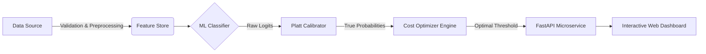

# Universal Design Playbook: Aesthetic Architecture for GitHub & UI Workflows

A master blueprint and component library for transforming technical repositories, developer documentation, and user interfaces into visually stunning, high-retention digital experiences.

---

## 1. What Are Design Elements? (The Core Anatomy of Aesthetics)

Design is not mere decoration; it is **visual communication and cognitive scaffolding**. When applied to software documentation and interfaces, design elements direct attention, clarify mental models, and build instant credibility.

```
┌─────────────────────────────────────────────────────────────┐
│                    VISUAL DESIGN ANATOMY                    │
├─────────────────┬─────────────────────┬─────────────────────┤
│ 1. Hierarchy    │ 2. Spatial Rhythm   │ 3. Color Tokens     │
│ F/Z-scannability│ Whitespace padding  │ WCAG AA contrast    │
├─────────────────┼─────────────────────┼─────────────────────┤
│ 4. Chunking     │ 5. Visual Anchors   │ 6. Disclosure       │
│ Micro-copy & UI │ Badges, Icons, Cards│ Accordions & modals │
└─────────────────┴─────────────────────┴─────────────────────┘
```

### 1.1 Visual Hierarchy & Scan Paths
* **F-Pattern & Z-Pattern:** Users don't read line-by-line; they scan along the top and down the left margin. The project logo, name, one-line value proposition, and key action buttons must reside in the top viewport.
* **Typographic Scale:** Establish a strict hierarchy (`H1` for title, `H2` for primary chapters, `H3` for features). Keep header cases uniform across every page.

### 1.2 Whitespace & Spatial Rhythm
* **Negative Space as a Feature:** Cramped layouts overwhelm the reader. Whitespace gives the eye resting intervals and isolates important technical takeaways.
* **Structural Dividers:** Use subtle visual breaks (`---`, `<hr />`, or padding) to separate distinct conceptual stages.

### 1.3 Color Tokens & Dual-Theme Adaptability
* **Semantic Roles:** Never pick arbitrary hex codes. Assign colors by role:
  * Primary / Brand: Core visual anchor (e.g., Deep Indigo `#6366F1` or Electric Teal `#0EA5E9`).
  * Success / Verification: Muted Emerald (`#10B981`).
  * Warning / Attention: Amber (`#F59E0B`).
  * Surface & Background: Light slate vs dark charcoal tokens.
* **GitHub Light/Dark Harmony:** Hardcoded dark text renders invisible in GitHub dark mode. Use transparent SVGs or GitHub's `#gh-dark-mode-only` / `#gh-light-mode-only` syntax.

### 1.4 Information Chunking & Cognitive Load
* **The 7±2 Principle:** Break monolithic paragraphs into scannable lists, 2x2 comparison tables, or visual cards.
* **Monospace Discipline:** Reserve inline backticks strictly for code tokens, file paths, variables, and commands.

### 1.5 Visual Signifiers (Icons, Badges, Callouts)
* **Shape + Color:** Accessibility requires that status does not depend on color alone. Pair colors with distinct shapes (e.g., checkmarks, warning triangles, diamond badges).
* **Native Callouts:** Use GitHub Alerts (`> [!NOTE]`, `> [!TIP]`, `> [!IMPORTANT]`, `> [!WARNING]`).

### 1.6 Progressive Disclosure
* Keep the main document lean. Place exhaustive parameter lists, raw logs, and supplementary questions inside expandable `<details><summary>` dropdowns.

---

## 2. Reusable Component Kit (Copy & Paste for Any Project)

### 2.1 Centered Hero Section with Dual Badges
```html
<p align="center">
  
</p>

<h1 align="center">Project Name</h1>

<p align="center">
  <strong>One sentence punchy value proposition explaining the core benefit.</strong>
</p>

<p align="center">
  <a href="#quickstart">Quickstart</a> •
  <a href="#features">Key Features</a> •
  <a href="#architecture">Architecture</a> •
  <a href="#benchmarks">Benchmarks</a> •
  <a href="#contributing">Contributing</a>
</p>

<p align="center">
  <a href="https://github.com/OWNER/REPO/releases"></a>
  <a href="https://github.com/OWNER/REPO/actions"></a>
  <a href="LICENSE"></a>
  <a href="https://github.com/OWNER/REPO/stargazers"></a>
</p>
```

---

### 2.2 Responsive 2x2 Feature Cards Grid
```html
<table width="100%">
  <tr>
    <td width="50%" valign="top">
      <h3>⚡ High-Throughput Engine</h3>
      <p>Sub-millisecond inference and parallelized batch evaluation designed for high-concurrency environments.</p>
    </td>
    <td width="50%" valign="top">
      <h3>🛡️ Zero-Leakage Pipeline</h3>
      <p>Strict split isolation with preprocessors fitted exclusively on training distributions to eliminate lookahead bias.</p>
    </td>
  </tr>
  <tr>
    <td width="50%" valign="top">
      <h3>🔍 Deep Explainability</h3>
      <p>Local and global feature attribution via SHAP value decomposition and transparent talking points.</p>
    </td>
    <td width="50%" valign="top">
      <h3>📊 Audit-Grade Observability</h3>
      <p>Append-only dual logging (JSON Lines + SQLite) for drift tracking, model verification, and campaign telemetry.</p>
    </td>
  </tr>
</table>
```

---

### 2.3 System Architecture Diagram (Mermaid.js)


---

### 2.4 Highlight KPI Tile Block
```html
<div align="center">
  <table>
    <tr>
      <td align="center"><strong>Recall on Churners</strong><br /><h2>96.5 %</h2></td>
      <td align="center"><strong>Total Cost Savings</strong><br /><h2>70.6 %</h2></td>
      <td align="center"><strong>Net Bottom-Line Saved</strong><br /><h2>₹14.7 Lakhs</h2></td>
      <td align="center"><strong>Test Set F1</strong><br /><h2>0.613</h2></td>
    </tr>
  </table>
</div>
```

---

### 2.5 GitHub Callout Boxes
```markdown
> [!NOTE]
> Background details or context that users should know when skimming.

> [!TIP]
> Pro-tip or workflow recommendation for optimal execution.

> [!IMPORTANT]
> Critical step or prerequisite needed to avoid failures.

> [!WARNING]
> Security notice or breaking change warning.
```

---

### 2.6 Progressive Disclosure Accordions
```html
<details>
  <summary><strong>🔍 Click to expand: Advanced API Configuration & Tuning Parameters</strong></summary>

| Parameter | Type | Default | Description |
|---|---|---|---|
| `batch_size` | `int` | `128` | Mini-batch dimension for neural network optimization |
| `learning_rate` | `float` | `0.001` | Adam optimizer initial step magnitude |
| `patience` | `int` | `15` | Early stopping epochs without validation improvement |

</details>
```

---

### 2.7 Contributor Team Cards
```html
<table align="center">
  <tr>
    <td align="center" width="250">
      <a href="https://github.com/fridayslifes">
        <br />
        <strong>Praveen</strong>
      </a><br />
      <em>Application Lead</em><br />
      <sub>FastAPI · Web UI · Deployment · API Tests</sub>
    </td>
    <td align="center" width="250">
      <a href="https://github.com/riya0jani">
        <br />
        <strong>Riya</strong>
      </a><br />
      <em>Model Lead</em><br />
      <sub>Data Pipeline · Baselines · PyTorch MLP · Cost Tuning</sub>
    </td>
  </tr>
</table>
```

---

## 3. Checklist for Any README Before Pushing

- [ ] **Hero has a clear hook:** Logo, 1-line summary, quick badges.
- [ ] **Instant quickstart:** User can run the project in <= 2 shell commands.
- [ ] **Architecture is visual:** Diagram included (Mermaid or SVG).
- [ ] **Tables are scannable:** Clear column headers and bold primary winners.
- [ ] **No walls of text:** Paragraphs capped at 3–4 sentences; lists and cards used.
- [ ] **Theme adaptive:** Works seamlessly in both GitHub dark and light modes.
- [ ] **Mobile & responsive:** Tables and images render cleanly on smaller screens.
