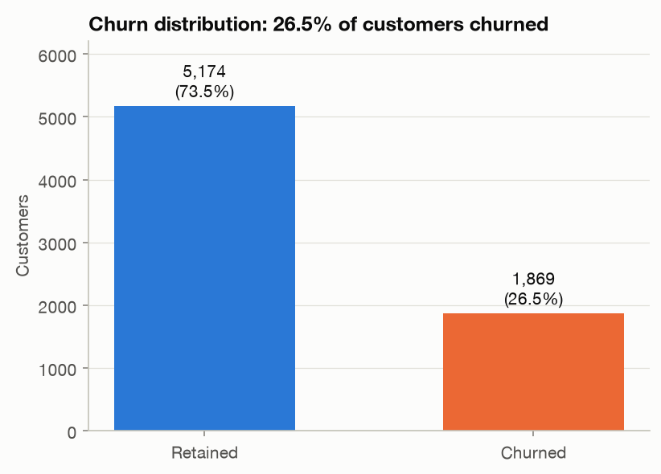
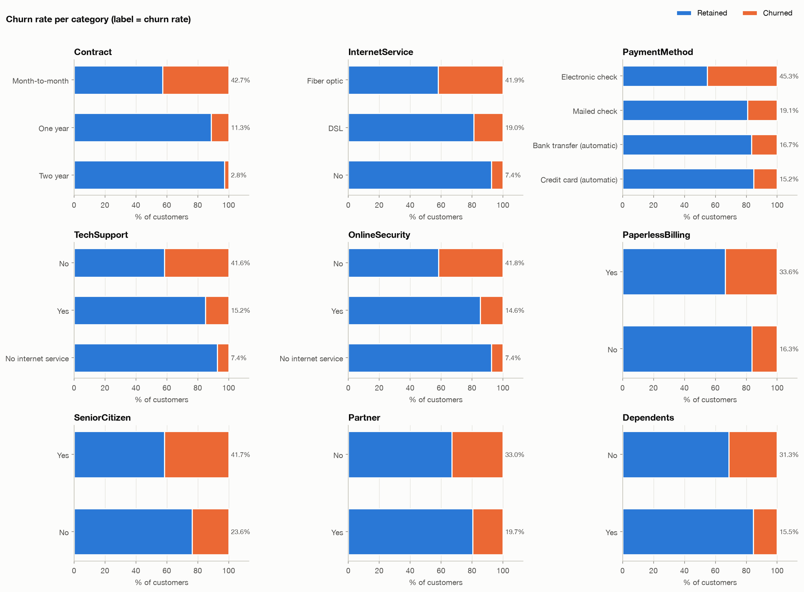
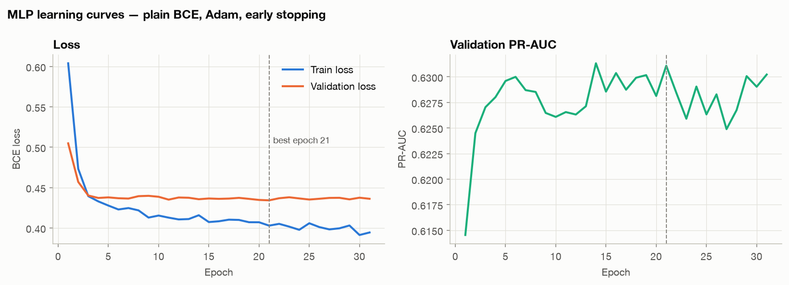
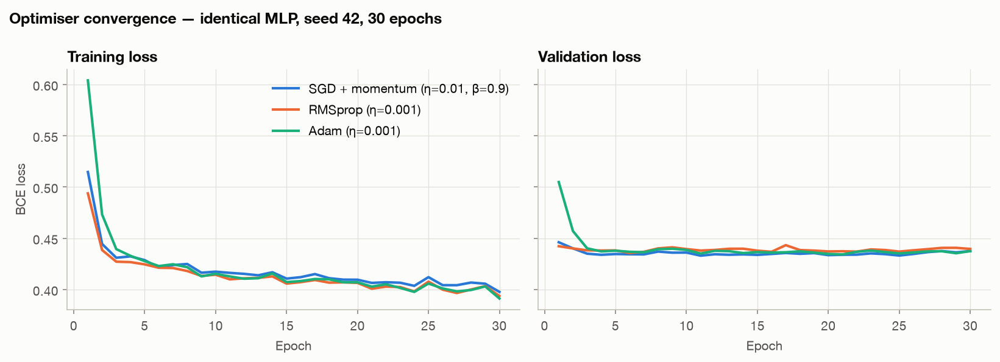
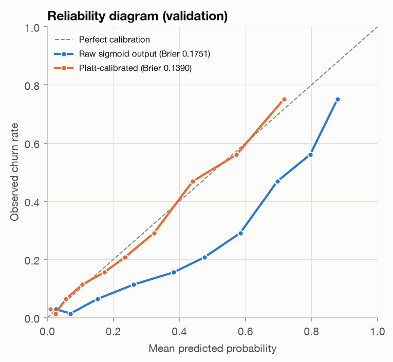
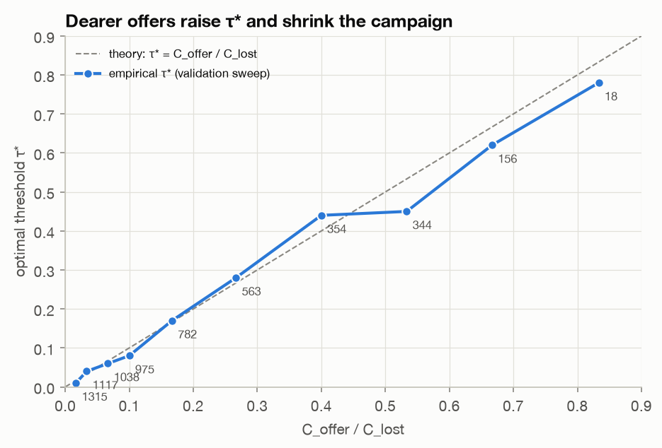
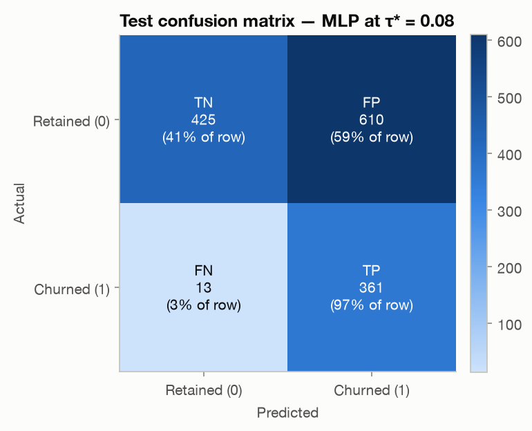
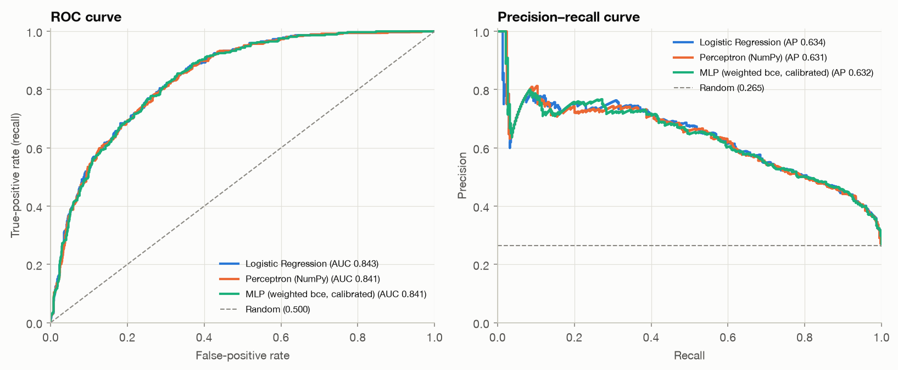
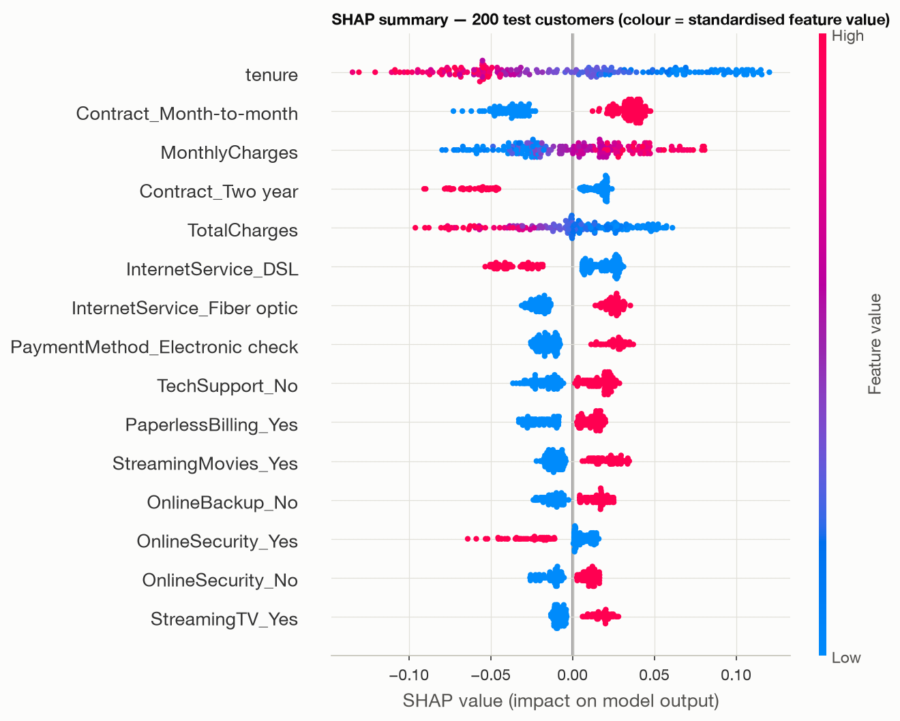
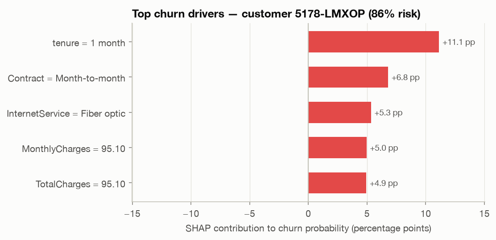

> **Draft for the team.** Every number below was produced by the notebooks in this repository (seed 42). Rewrite the prose in your own words before submission — you must be able to defend every sentence in the viva. Export to PDF from the project root with `pandoc report/report.md -o report/report.pdf --resource-path=report --pdf-engine=xelatex -V mainfont="DejaVu Serif" -V geometry:margin=2.2cm` (the DejaVu font contains ₹, τ and Σ; on Colab first run `!apt-get -q install pandoc texlive-xetex fonts-dejavu`), or use the VS Code *Markdown PDF* extension.

## 1. Executive summary & course-outcome mapping

A telecom operator loses about one customer in four (26.5 % in our data). Retaining a customer with a targeted offer is far cheaper than acquiring a replacement, but offers cost money, so the operator needs to know **whom** to contact. We built an early-warning system that (i) ranks customers by calibrated churn probability with a multi-layer perceptron, (ii) handles the class imbalance explicitly, (iii) chooses the decision threshold that **minimises business cost** (₹1,500 per offer vs ₹15,000 per lost customer) instead of maximising accuracy, and (iv) serves predictions, SHAP explanations and a live cost simulator through our own FastAPI backend, logging every prediction.

On a held-out test set evaluated once, the deployed policy (τ\* = 0.08) catches **361 of 374 churners (recall 0.965)** and costs **₹16.5 lakh**, versus ₹31.2 lakh at the default 0.5 threshold and ₹56.1 lakh for doing nothing — a **70.6 % cost reduction**.

**Team contributions.** Riya (Model Lead) built the data pipeline, preprocessing, both baselines, the MLP, the imbalance ablation, calibration and the cost-threshold analysis (notebooks 01–06). Praveen (Application Lead) built the FastAPI inference service, the dashboard, prediction logging, deployment and the API tests. The final evaluation, SHAP analysis and this report were written jointly, and both members can explain all training and application code.

**CO1 mapping (understanding ANNs, optimisation and regularisation).** We derive and implement back-propagation for a single-layer perceptron from scratch (§4), build a PyTorch MLP with batch normalisation, dropout, L2 weight decay and early stopping (§5), compare SGD-momentum, RMSprop and Adam empirically (§5.3), justify ReLU vs sigmoid via the vanishing-gradient argument (§5.4), and implement focal loss from scratch (§6).

## 2. Exploratory data analysis

The IBM/Kaggle *Telco Customer Churn* table has 7,043 customers, 19 features (demographics, services, contract, billing) and a binary target.

{width=45%} {width=54%}

Key findings:

1. **Imbalance:** 1,869 churners (26.5 %), a 2.77 : 1 ratio. A model predicting "no churn" for everyone would be 73.5 % accurate and useless — accuracy is not an acceptable metric.
2. **Contract:** month-to-month customers churn at 42.7 %, one-year at 11.3 %, two-year at 2.8 %.
3. **Tenure:** median tenure is 10 months for churners vs 38 for retained customers; first-year customers churn at 47.4 % vs 9.5 % after four years.
4. **Product & price:** fibre-optic customers churn at 41.9 % (DSL 19.0 %); the fibre + month-to-month segment (2,128 customers) churns at 54.6 %.
5. **Payment & support:** electronic-cheque payers churn at 45.3 % (others 15–19 %); customers without TechSupport/OnlineSecurity churn at ≈42 % vs ≈15 % with them.

`TotalCharges` is strongly correlated with tenure (r = 0.83), a redundancy that later explains why linear coefficients are unstable (§4) and why we use SHAP for importance (§9).

## 3. Data pipeline & leakage controls

**Cleaning.** `TotalCharges` is read as text because 11 cells contain a single space. All 11 rows — and only those rows — have `tenure = 0`: new customers not yet billed, so the true value is **0.0** (mean imputation would invent ≈2,283 of charges). `SeniorCitizen` (0/1) is mapped to No/Yes; `Churn` to 1/0; `customerID` is kept for identification but never used as a feature.

**Split.** Stratified 60/20/20 (4,225 / 1,409 / 1,409 rows, churn rate 26.5 % in each) via two `train_test_split(stratify=y, random_state=42)` calls. An assertion checks that no customer ID appears in two splits.

**Encoding.** `StandardScaler` on the three numeric columns and `OneHotEncoder(handle_unknown="ignore", drop="if_binary")` on 16 categorical columns → 40 features. Both are **fitted on the training split only**; validation, test and every file uploaded to the web app are only `.transform()`-ed. After scaling, training columns have mean exactly 0 / std 1 whereas validation/test do not — evidence the scaler never saw them.

**Test-once discipline.** The course requires reporting test metrics only once. `load_splits()` returns the test arrays only when called with `include_test=True`, which appears in notebook 07 alone. All model selection (learning rate, imbalance strategy, calibration, threshold) uses the validation split.

## 4. Baselines & back-propagation derivation

**Logistic regression** (scikit-learn, L-BFGS, default L2 with C = 1).

**Single-layer perceptron (pure NumPy, from scratch).** For a mini-batch $X\in\mathbb{R}^{m\times d}$: $z = XW + b$, $\hat y = \sigma(z)$, and binary cross-entropy $L = -\frac1m\sum_i [y_i\log\hat y_i + (1-y_i)\log(1-\hat y_i)]$. By the chain rule,

$$\frac{\partial L}{\partial z_i} = \frac{\partial L}{\partial \hat y_i}\cdot\frac{\partial \hat y_i}{\partial z_i} = \frac1m\frac{\hat y_i-y_i}{\hat y_i(1-\hat y_i)}\cdot \hat y_i(1-\hat y_i) = \frac1m(\hat y_i - y_i),$$

$$\frac{\partial L}{\partial W} = \frac1m X^\top(\hat y - y), \qquad \frac{\partial L}{\partial b} = \frac1m\sum_i(\hat y_i-y_i),$$

and parameters are updated by mini-batch gradient descent $\theta \leftarrow \theta - \eta\nabla_\theta L$ (batch 64, shuffled every epoch). A central finite-difference **gradient check** agrees with these formulas to a relative error of $2.4\times10^{-10}$. The sigmoid is implemented in a numerically stable two-branch form, and BCE clips $\hat y$ to $[\varepsilon, 1-\varepsilon]$.

The learning rate was chosen on validation from {0.5, 0.1, 0.05, 0.01} (300 epochs): η = 0.5 oscillates (training-loss std over the last 50 epochs 0.17), while η = 0.01 converges smoothly to the same loss as scikit-learn (0.409 vs 0.408).

| Model (validation) | Implementation | Precision | Recall | F1 | PR-AUC | ROC-AUC |
|---|---|---|---|---|---|---|
| Logistic Regression | scikit-learn | 0.657 | 0.532 | 0.588 | 0.642 | 0.836 |
| Single-Layer Perceptron | Pure NumPy | 0.667 | 0.535 | 0.594 | 0.640 | 0.835 |

The two are the same model family and make near-identical predictions, yet their weights correlate only at r = 0.88: the disagreement sits on the collinear `TotalCharges`/`MonthlyCharges` pair (even the sign of `MonthlyCharges` flips). This is a textbook consequence of collinearity and a reason not to read linear coefficients as feature importances.

## 5. Deep-learning MLP: architecture & optimisation

### 5.1 Architecture
`Linear(40,64) → BatchNorm1d → ReLU → Dropout(0.3) → Linear(64,32) → BatchNorm1d → ReLU → Dropout(0.3) → Linear(32,1) → Sigmoid` — 4,929 trainable parameters. BatchNorm normalises each hidden unit over the mini-batch (stabilising training, mild regularisation) and switches to running statistics in `eval()` mode so single customers can be scored deterministically. Dropout zeroes 30 % of hidden units during training to prevent co-adaptation. Adam uses `weight_decay = 1e-4`, i.e. an L2 penalty $\frac\lambda2\lVert\theta\rVert^2$. Because 4,225 = 66×64 + 1, the final mini-batch would contain one sample, for which BatchNorm cannot compute a variance; the loader therefore uses `drop_last=True` (a different sample is skipped each epoch because of reshuffling).

### 5.2 Training & early stopping
Maximum 150 epochs, batch 64; the weights with the lowest validation loss are kept and training stops after 10 epochs without improvement. With plain BCE the best epoch was 21 (stopped at 31, about a second on a laptop CPU). Validation loss is below training loss in the first epochs because the training loss is measured with dropout active.

### 5.3 Optimiser comparison (30 epochs, identical initial weights and batch order)

| Optimiser | Train loss @1 | @5 | @30 | Min val loss (epoch) | Val PR-AUC @30 |
|---|---|---|---|---|---|
| SGD + momentum (η 0.01, β 0.9) | 0.515 | 0.429 | 0.398 | 0.433 (11) | 0.625 |
| RMSprop (η 0.001) | 0.494 | 0.425 | 0.394 | 0.436 (6) | 0.627 |
| Adam (η 0.001) | 0.604 | 0.428 | **0.391** | 0.434 (21) | **0.629** |

Adam starts slowest: its early per-parameter steps are ≈η = 0.001 because $\hat m/\sqrt{\hat v}\approx\pm1$, whereas SGD with momentum takes an effective step of $\eta/(1-\beta) = 0.1$ along a consistent gradient. By epoch 5 the three are within 0.005 of one another — standardised inputs and BatchNorm make this small problem well conditioned — and by epoch 30 Adam has the lowest training loss and the best validation PR-AUC. We therefore keep Adam, but state honestly that its advantage here is robustness without tuning (momentum + per-parameter RMS scaling, helpful for sparse one-hot inputs) rather than dramatically faster convergence.

### 5.4 Activation functions
Hidden layers use ReLU: its derivative is 1 for active units, whereas the sigmoid derivative is at most 0.25 and vanishes in saturation, so gradients shrink geometrically through stacked sigmoid layers (≤ 0.25¹⁰ ≈ 10⁻⁶ after ten layers). The output layer uses a sigmoid because we need a probability in (0, 1) for BCE and for cost-based thresholding; paired with BCE its derivative cancels, giving the clean output gradient $\hat y - y$.

## 6. Class-imbalance ablation

Architecture, optimiser, early stopping and seed are fixed; only the imbalance strategy changes. Metrics are on the **validation** split at τ = 0.5.

| Strategy | Precision | Recall | F1 | PR-AUC | ROC-AUC | Mean PR-AUC, seeds 42–46 |
|---|---|---|---|---|---|---|
| 1. Plain BCE | 0.641 | 0.559 | 0.597 | 0.631 | 0.832 | 0.6351 ± 0.0039 |
| 2. Weighted BCE (pos_weight = 2.77) | 0.498 | 0.791 | 0.611 | **0.635** | **0.834** | **0.6381 ± 0.0025** |
| 3. Random oversampling (train only) | 0.526 | 0.751 | 0.619 | 0.626 | 0.831 | 0.6309 ± 0.0063 |
| 4. Focal loss, from scratch (γ 2, α 0.75) | 0.481 | 0.826 | 0.608 | 0.632 | 0.833 | 0.6358 ± 0.0034 |

**Focal loss** is $FL(p_t) = -\alpha_t(1-p_t)^\gamma\log p_t$, implemented from logits with `logsigmoid` for numerical stability; with γ = 0, α = 0.5 it reduces exactly to ½·BCE (unit-tested). The modulating factor cuts the loss of an easy example with $p_t$ = 0.95 by 400×, focusing training on hard, ambiguous customers; α re-weights the classes.

**Winner: class-weighted BCE.** The selection rule, fixed in advance, was the highest mean validation PR-AUC over five seeds — weighted BCE wins both on seed 42 and on average, with low variance. The spread across strategies (≈0.01) is small: their main effect is to *move the operating point* (recall at 0.5 rises from 0.56 to 0.79–0.83), and since the operating point is re-chosen by cost in §7, ranking quality (PR-AUC) is the right criterion. All three re-weighting methods inflate probabilities (mean predicted p = 0.43 for weighted BCE vs a true rate of 0.265; Brier 0.175 vs 0.141 for plain BCE), which we fix by calibration.

## 7. Cost-based threshold optimisation

**Calibration.** Platt scaling $p_{cal} = \sigma(a z + b)$ fitted on validation logits gives a = 1.012, b = −1.088: essentially a shift that removes the pos-weight inflation. Mean predicted p becomes 0.2654 (observed 0.2654) and the Brier score falls from 0.175 to 0.139; PR-AUC is unchanged because the map is monotonic.

**Cost model.** $\text{TotalCost}(\tau) = FN\cdot C_{lost} + (TP+FP)\cdot C_{offer}$ with $C_{offer}$ = ₹1,500 and $C_{lost}$ = ₹15,000, assuming an offer retains a true churner. For a calibrated probability p, an offer is worth sending iff $pC_{lost} > C_{offer}$, i.e. $p > C_{offer}/C_{lost} = 0.10$.

{width=42%} {width=55%}

**Recommendation.** We recommend **τ\* = 0.08**, the minimum of the validation sweep and close to the theoretical 0.10. On the validation set (1,409 customers) it flags 975 customers (69.2 %), catching 359 of 374 churners, for a total cost of **₹16,87,500**. Doing nothing would cost ₹56,10,000, so the policy saves **₹39,22,500 (69.9 %)**; targeting everyone would cost ₹21,13,500, so it also saves ₹4,26,000 (20.2 %). The naive 0.5 threshold flags only 287 customers and costs ₹32,05,500 — ₹15,18,000 more — because each missed churner costs ten offers.

The recommendation is sensitive to the cost ratio: raising $C_{offer}$ to ₹6,000 (ratio 0.40) moves τ\* to 0.44 and shrinks the campaign from 975 to 354 customers, tracking the theoretical line $\tau^* = C_{offer}/C_{lost}$ (`plots/threshold_sensitivity.png`). With calibrated probabilities, the dashboard's label-free projection of the validation cost at τ\* (₹16,63,309) is within 1.5 % of the realised cost; with uncalibrated probabilities it would have overstated the do-nothing cost by 63 %.

## 8. Test-set evaluation (single run)

| Model | Precision | Recall | F1 | PR-AUC | ROC-AUC |
|---|---|---|---|---|---|
| Logistic Regression (τ 0.50) | 0.649 | 0.554 | 0.597 | 0.634 | 0.843 |
| Single-Layer Perceptron (τ 0.50) | 0.648 | 0.556 | 0.599 | 0.631 | 0.841 |
| MLP, weighted BCE (τ 0.50) | 0.651 | 0.524 | 0.581 | 0.632 | 0.842 |
| MLP, weighted BCE (τ_F1 0.33, chosen on val) | 0.535 | 0.719 | **0.613** | 0.632 | 0.842 |
| **MLP, weighted BCE (τ\* 0.08, deployed)** | 0.372 | **0.965** | 0.537 | 0.632 | 0.842 |

{width=42%} {width=57%}

At τ\* the confusion matrix is TN 425, FP 610, FN 13, TP 361; total cost ₹16,51,500 vs ₹31,21,500 at τ = 0.5 and ₹56,10,000 for doing nothing.

**Success criteria.**

* *MLP matches or beats LR on PR-AUC* — **partially met.** 0.632 vs 0.634 (Δ = −0.002). A paired bootstrap (2,000 resamples) gives a 95 % CI of [−0.010, +0.005] for the difference: the models are statistically indistinguishable, so the MLP *matches* but does not beat LR. The EDA explains why: the dominant signals (contract, tenure, internet type) act almost additively on the log-odds, so a linear model already captures most of the structure, and 4,225 training rows leave little room for the MLP's extra capacity.
* *Churn-class F1 ≥ 0.60* — **met** at the validation-selected F1 threshold (0.613). At the deployed τ\* F1 is 0.537 by design: F1 weights false alarms and misses equally, while the business says a miss costs 10× more.
* *Cost-based threshold beats 0.5* — **met**: ₹14.7 lakh cheaper on the test set.

## 9. Explainability

SHAP `DeepExplainer` is applied to the calibrated model with 200 random training customers as background; contributions satisfy $f(x) = E[f(X)] + \sum_j\phi_j$ up to a numerical error of about $10^{-7}$. One-hot columns are summed back into business features. Globally, **Contract** (mean |φ| = 7.1 pp), **tenure** (5.7 pp) and **InternetService** (4.7 pp) dominate, followed by MonthlyCharges, PaymentMethod and TotalCharges — consistent with the EDA.

{width=55%} {width=44%}

Locally, `get_customer_top_drivers` returns the five largest contributions for one customer. The highest-risk test customer (85.5 % vs a 27.5 % base rate) is driven by a 1-month tenure (+11.1 pp), a month-to-month contract (+6.8 pp) and fibre internet (+5.3 pp); the lowest-risk customer (0.4 %) by a two-year contract (−7.1 pp) and 72-month tenure (−5.5 pp). Contract and support add-ons are actionable levers (discounted annual plan, bundled tech support); SHAP describes the model's reasoning, not causal effects.

## 10. Application architecture & prediction logging

**Backend (FastAPI).** `ChurnPredictor` (in `src/inference.py`) loads the scaler, encoder, MLP weights, Platt parameters, τ\* and SHAP background once at start-up and reuses the *same* cleaning and encoding code as training, preventing training/serving skew. Endpoints: `POST /api/predict` (CSV upload → ranked table), `POST /api/predict/single` (JSON customer, validated with a Pydantic schema), `POST /api/explain` (top-5 SHAP drivers), `GET /api/logs`, `GET /api/config`, `GET /api/health`. Uploads are validated (extension, size, empty files, missing columns — listed in a 422 response, unparseable rows — skipped and reported, unseen categories — encoded as zeros and flagged); CPU-bound work runs in a thread pool so the server stays responsive; if artefacts are missing the server still starts and returns 503 with instructions.

**Front end.** A single Bootstrap page with a custom design system (colour tokens with light/dark themes and a hand-drawn SVG icon set in which the High, Medium and Low tiers have different *shapes* as well as colours). An empty-state hero explains the three-step workflow and offers a one-click sample upload; CSV files can be dropped anywhere on the page. The campaign planner has a threshold slider marked with the recommended τ\*, the break-even ratio $C_{offer}/C_{lost}$ and the cheapest threshold for the current batch, editable costs, and KPI tiles for targeted customers, campaign cost, expected missed loss, total cost and net savings. Two linked SVG charts show the probability histogram (targeted vs not) and the expected-cost curve, which can be clicked to set τ. The ranked table (sortable, filterable, "targeted only") opens a side panel per customer with a risk gauge, the offer decision and its expected value $pC_{lost} - C_{offer}$, the top-5 SHAP drivers and suggested talking points, and ↑/↓ navigation between customers; the targeted list can be exported as CSV. All economics are recomputed in the browser with the same expected-value formulas as `cost_optimizer.expected_cost_unlabeled` (using sorted probabilities and prefix sums, one binary search per threshold), which is why calibration matters.

**Prediction logging.** Every scored customer is appended to `logs/predictions.jsonl` (append-only JSON Lines) and mirrored to an SQLite table: timestamp, customer ID, probability, tier, threshold used, offer decision, batch ID, source, and a model version (`strategy-<sha256 prefix of the weights>`). Logs support drift monitoring (shifts in the score distribution), auditing (why a customer did or did not get an offer, with which model) and, once outcomes are known, measuring real campaign precision and retention.

## 11. Conclusion & viva defence summary

We delivered a leakage-free pipeline, a from-scratch perceptron with verified gradients, a regularised PyTorch MLP, a controlled imbalance ablation with a from-scratch focal loss, calibrated probabilities, a cost-optimal threshold with a written recommendation, SHAP explanations and a logged, tested web application. The MLP ties a strong logistic-regression baseline on ranking quality, and the largest business gain comes from **choosing the threshold by cost** (a 47 % saving over the default 0.5 threshold on the test set), which in turn depends on **calibrated probabilities**.

*Limitations & future work.* The cost model assumes every offer retains a churner; a real campaign should estimate the acceptance rate (e.g. an A/B test) and use uplift modelling to target customers whose behaviour the offer actually changes. Retraining on logged outcomes and monitoring score drift would keep the model current. Gradient-boosted trees would be a natural additional baseline for tabular data.

**Viva defence summary.**

* *Why fit the scaler on train only?* Validation and test simulate unseen customers; fitting on them leaks their statistics and inflates metrics.
* *Why PR-AUC?* With 26.5 % positives, ROC-AUC is flattered by the many true negatives; PR-AUC focuses on the churn class (random baseline 0.265, ours 0.632).
* *What if offers cost more?* τ\* rises with $C_{offer}/C_{lost}$ (₹6,000 → τ\* = 0.44, 354 instead of 975 customers).
* *Why log predictions?* Drift monitoring, auditing each decision to exact model weights, and measuring real campaign impact.
* *Focal loss vs BCE?* $(1-p_t)^\gamma$ down-weights easy examples of both classes (400× at $p_t$ = 0.95); $\alpha_t$ re-weights churners.
* *Adam vs SGD-momentum vs RMSprop?* All converge within five epochs here; Adam reaches the lowest loss and best PR-AUC but was not faster at the start.
* *Why ReLU inside, sigmoid outside?* ReLU avoids vanishing gradients (σ′ ≤ 0.25 per layer); the sigmoid gives the probability needed for BCE and thresholds.
* *Why calibrate?* Weighted BCE inflates probabilities (mean 0.43 vs 0.265); Platt scaling fixes the scale without changing the ranking, so tiers and ₹ projections are trustworthy.

The full question bank with detailed answers is in `report/viva_guide.md`.

## References

1. IBM, *Telco Customer Churn* dataset. https://github.com/IBM/telco-customer-churn-on-icp4d
2. Lin, T.-Y., Goyal, P., Girshick, R., He, K. & Dollár, P. (2017). Focal Loss for Dense Object Detection. *ICCV*.
3. Platt, J. (1999). Probabilistic Outputs for Support Vector Machines and Comparisons to Regularized Likelihood Methods.
4. Lundberg, S. M. & Lee, S.-I. (2017). A Unified Approach to Interpreting Model Predictions. *NeurIPS*.
5. Kingma, D. P. & Ba, J. (2015). Adam: A Method for Stochastic Optimization. *ICLR*.
6. Ioffe, S. & Szegedy, C. (2015). Batch Normalization. *ICML*.
7. Srivastava, N. et al. (2014). Dropout: A Simple Way to Prevent Neural Networks from Overfitting. *JMLR*.
